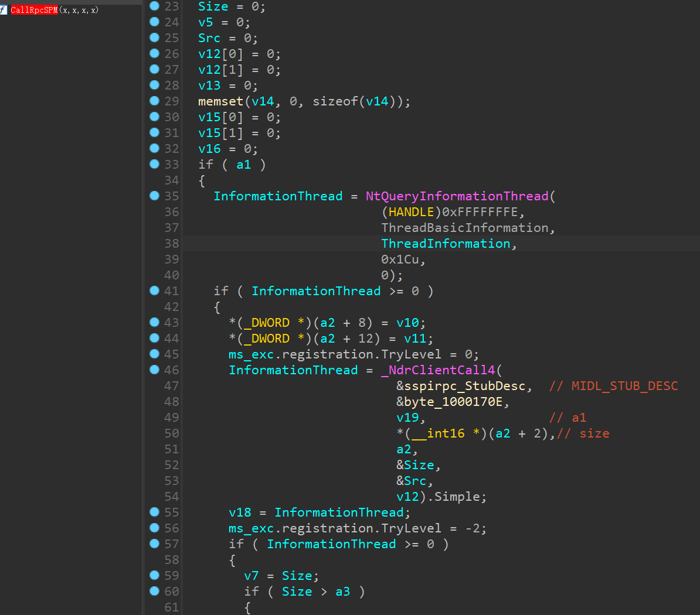
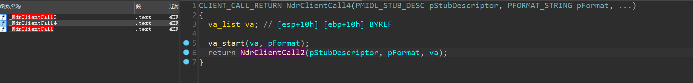

# Issues Porting AddSecurityPackage_RawRPC.c to x86


### First problem running it as is

After the generation with a x86 `.idl`, I noticed that `Proc0_SspirConnectRpc` uses `NdrClientCall2` function and with only one parameter instead. It failed with `0x6e4 - The requested operation is not supported`.


Therefore, I tried to pass all five arguments like `NdrClientCall3` as following

```c
_RetVal = NdrClientCall2(
		(PMIDL_STUB_DESC)&DefaultIfName_StubDesc,
		(PFORMAT_STRING)&lsass__MIDL_ProcFormatString.Format[0],
		(unsigned char*)&arg_1, 
		&arg_2, &arg_3, &arg_4, &arg_5
	);
```

It still failed with error code `0x6e4 - The requested operation is not supported`.


## win64 offset

```text
+0	ec
+2	size
+0	??
+8	pid
+10	tid
+28	function id
+40	uncode
+d0	addr ??
+d8	sspname
```
## win32 offset

```text
+0	cc
+2	size
+8	pid
+C	tid
+18	function id
+28	uncode
+a0	addr
+a8	sspname
```

## Potential Win32 Fix

I retrived the new IDL file from rpcview and use `midl` to generate the corresponding `.c` and `.h` files.

### 0x01. Fixing `default_IfHandle`

I followed the same idea to change `&DefaultIfName__MIDL_AutoBindHandle` to `&default_IfHandle` like below code.

```c
static const MIDL_STUB_DESC DefaultIfName_StubDesc =
{
    (void*)&DefaultIfName___RpcClientInterface,
    MIDL_user_allocate,
    MIDL_user_free,
    &default_IfHandle,//&DefaultIfName__MIDL_AutoBindHandle,
    0,
    0,
    0,
    0,
    lsass__MIDL_TypeFormatString.Format,
    1, /* -error bounds_check flag */
    0x60001, /* Ndr library version */
    0,
    0x8010272, /* MIDL Version 8.1.626 */
    0,
    0,
    0,  /* notify & notify_flag routine table */
    0x1, /* MIDL flag */
    0, /* cs routines */
    0,   /* proxy/server info */
    0
};
```

### 0x2. Fixing the type of the RPC packet fields and offset

Instead of using `unsigned long long*`, I modified the type to `unsigned long*` for process ID and thread ID, etc. I also fixed the offset of `&unk1` to `0xa0`.

```c
    mbstowcs((wchar_t*)(rpcPacket + 0xa8), argv[1], (sizeof(rpcPacket) - 0xa8) / 2);
	packetLen = 0xd8 + packageName.MaximumLength;
	// Complete RPC packet fields
	*(unsigned long*)rpcPacket = 0xcc; // ??
	*(unsigned short*)(rpcPacket + 2) = packetLen; // Length of packet
	*(unsigned long*)((char*)rpcPacket + 8) = GetCurrentProcessId();  // Process ID
	*(unsigned long*)((char*)rpcPacket + 0xc) = GetCurrentThreadId();  //Thread ID
	*(unsigned long*)((char*)rpcPacket + 0x18) = 0x0b;  // RPC call ID
	*(void**)((char*)rpcPacket + 0xa0) = &unk1; // ??
```


## NdrClientCall3 does not exist in win32

Through reverse engineering `CallRpcSPM` with IDA, I found that the function `NdrClientCall3` does not exist in win32. There is only `NdrClientCall4` and `NdrClientCall2`.

And 'NdrClientCall4' is just a wrapper for 'NdrClientCall2'





```c
long Proc0_SspirConnectRpc(
	/* [string][unique][in] */ unsigned char* arg_1,
	/* [in] */ long arg_2,
	/* [out] */ long* arg_3,
	/* [out] */ long* arg_4,
	/* [context_handle][out] */ void** arg_5)
{

	CLIENT_CALL_RETURN _RetVal;

	_RetVal = NdrClientCall2(
		(PMIDL_STUB_DESC)&DefaultIfName_StubDesc,
		(PFORMAT_STRING)&lsass__MIDL_ProcFormatString.Format[0],
		(unsigned char*)&arg_1);
	return (long)_RetVal.Simple;

}
```

